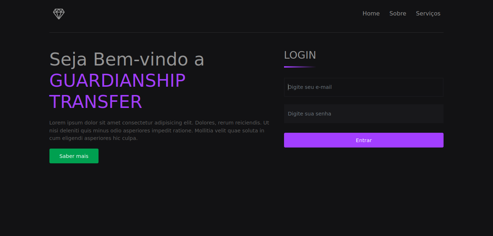
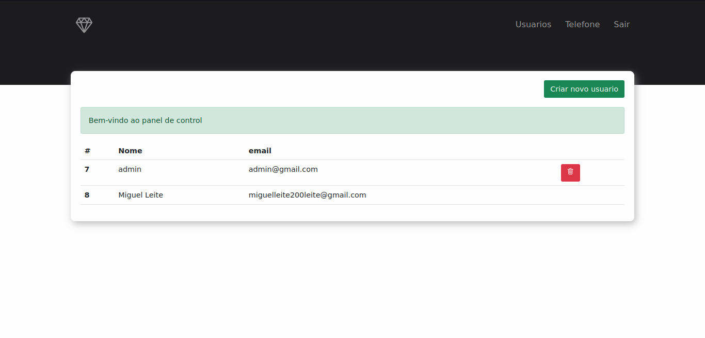
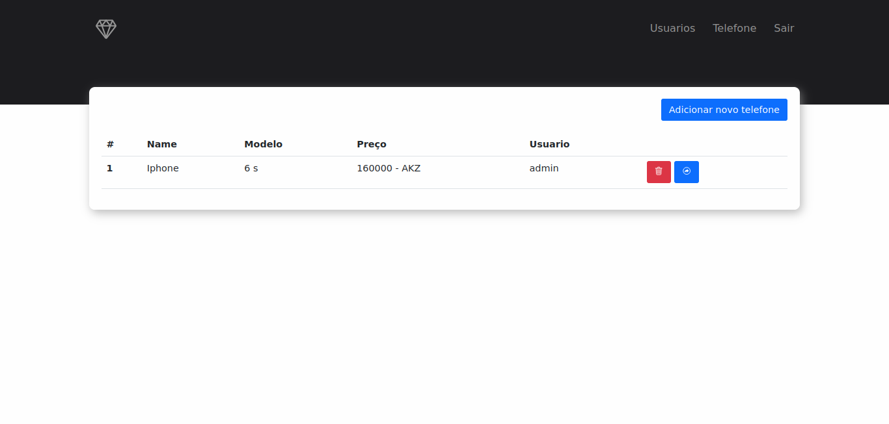
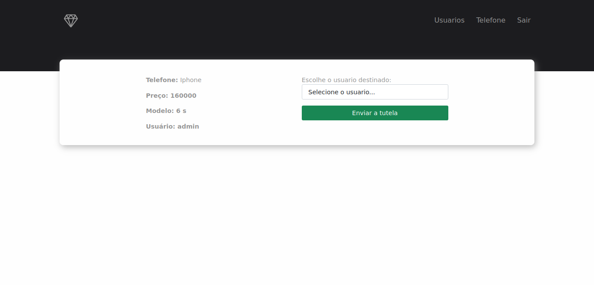

## Guardianship Transfer

É um projecto feito para teste dada Pela Empresa Petro Host, com objectivos de teste os meus conhecimentos ou experiência como desenvolvedor, na seguinte linguagem: PHP(Laravel).

### VISUALIZAÇÃO DA APLICAÇÃO

Pagina inicial da aplicação: 

 

 Pagina responsavel por carregar e adicionar usuario: 

 

 Pagina responsavel por carregar e adicionar telefone: 

 Tela responsavel por fazer a transferência de tutela: 

### FUNCIONALIDADES DA APLICAÇÃO

- [x] Criação, remoção de usuário
- [x] Criação, remoção de telefone
- [x] Transferência de tutela